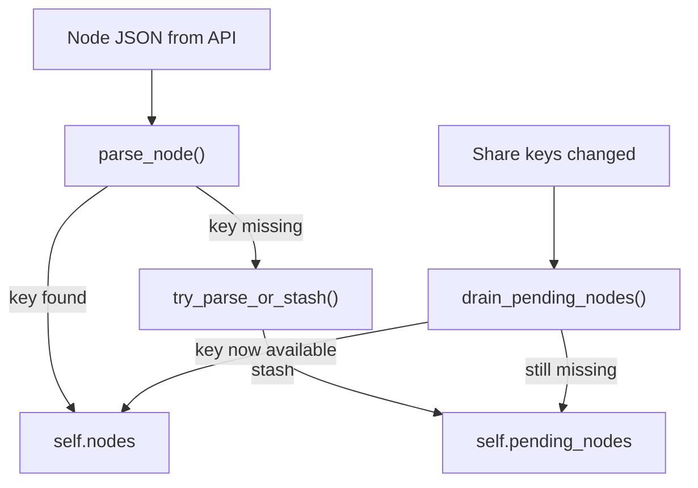

# Implement Deferred Node Key Queue

## Problem

Today, when `Session::parse_node` cannot decrypt a node's key (because the required share key is not yet in `self.share_keys`), the node is **silently dropped**. This happens in two places:

- `[src/fs/operations/tree.rs:105-114](src/fs/operations/tree.rs)` — during `refresh()`, failed nodes are skipped
- `[src/session/action_packets.rs:423-426](src/session/action_packets.rs)` — during `handle_actionpacket_newnodes`, failed nodes are skipped

The C++ SDK handles this with `NodeManager::addNodePendingApplykey` (stash nodes) + `applyKeys_internal` (retry when keys arrive) + `NoKeyLogger` (diagnostics).

## Design

Store the raw JSON (`serde_json::Value`) of nodes that fail key decryption in a new `pending_nodes` queue on `Session`. When share keys change (after promotion, `^!keys` sync, or new share packets), drain the queue by re-attempting `parse_node` on each stashed entry.




## Changes

### 1. Add `pending_nodes` field to `Session`

In `[src/session/core.rs](src/session/core.rs)`, add:

```rust
pub(crate) pending_nodes: Vec<serde_json::Value>,
```

Initialize to `Vec::new()` in the constructor. This stores raw node JSON blobs whose keys could not be decrypted.

### 2. Split `parse_node` to distinguish key-missing vs corrupt

In `[src/fs/operations/tree.rs](src/fs/operations/tree.rs)`, add a helper that distinguishes "key not available" from "structurally invalid JSON":

```rust
fn try_parse_or_stash(&mut self, json: &Value) -> Option<Node> {
    // First, check structural validity (has "h", "t", etc.)
    // If structurally invalid, return None (don't stash garbage)
    // If decrypt_node_key returns None, stash in self.pending_nodes
    // If decrypt_node_attrs returns None, stash (key may decrypt but attrs are garbled — rare)
    // Otherwise return parsed node
}
```

The key insight: `decrypt_node_key` returns `None` both when there's no matching key handle AND when base64 decoding fails. We need to check whether at least one `key_handle` in the `"k"` field references a handle that is neither `self.user_handle` nor in `self.share_keys` — that means a share key might arrive later. If the handle matches but decryption fails, the data is corrupt and should not be stashed.

### 3. Add `drain_pending_nodes` to `Session`

In `[src/fs/operations/tree.rs](src/fs/operations/tree.rs)`, add:

```rust
pub(crate) fn drain_pending_nodes(&mut self) -> bool {
    let pending = std::mem::take(&mut self.pending_nodes);
    let mut changed = false;
    for json in pending {
        if let Some(node) = self.parse_node(&json) {
            self.upsert_node(node);
            changed = true;
        } else {
            self.pending_nodes.push(json);
        }
    }
    if changed {
        Self::build_node_paths(&mut self.nodes);
    }
    changed
}
```

### 4. Update `refresh()` to stash failed nodes

In `[src/fs/operations/tree.rs](src/fs/operations/tree.rs)`, change the node-parsing loop (lines 105-114) from:

```rust
if let Some(mut node) = self.parse_node(node_json) { ... }
```

to use `try_parse_or_stash`, stashing nodes that fail due to missing keys.

### 5. Update `handle_actionpacket_newnodes` to stash failed nodes

In `[src/session/action_packets.rs:423-426](src/session/action_packets.rs)`, apply the same pattern: use `try_parse_or_stash` instead of `parse_node` so that nodes arriving via action packets with not-yet-available keys are queued.

### 6. Call `drain_pending_nodes` after share key changes

Add calls to `drain_pending_nodes()` at the points where share keys change:

- `[src/session/key_sync.rs](src/session/key_sync.rs)` — `sync_keys_attribute_internal` (after `rebuild_share_key_cache`, ~line 752)
- `[src/session/key_sync.rs](src/session/key_sync.rs)` — `promote_pending_shares_internal` (after storing a new share key, ~line 386)
- `[src/session/action_packets.rs](src/session/action_packets.rs)` — `handle_actionpacket_share` (after inserting a new share key)
- `[src/fs/operations/tree.rs](src/fs/operations/tree.rs)` — end of `refresh()` (after all share keys are loaded but before returning)

### 7. Add diagnostic logging

Add `tracing::debug!` logging when:

- A node is stashed (with handle and the missing key handle)
- A node is recovered from the pending queue
- The pending queue is drained with N remaining

This replaces the C++ SDK's `NoKeyLogger` pattern.

### 8. Cap the pending queue

Add a constant `MAX_PENDING_NODES: usize = 4096` and drop the oldest entries when exceeded, with a warning log. This prevents unbounded memory growth if a share key never arrives.

## Files Modified

- `[src/session/core.rs](src/session/core.rs)` — add `pending_nodes` field
- `[src/fs/operations/tree.rs](src/fs/operations/tree.rs)` — add `try_parse_or_stash`, `drain_pending_nodes`, update `refresh()`
- `[src/session/action_packets.rs](src/session/action_packets.rs)` — update `handle_actionpacket_newnodes`, call drain after share changes
- `[src/session/key_sync.rs](src/session/key_sync.rs)` — call `drain_pending_nodes` after key changes

## Public API Impact

**None.** `pending_nodes` is `pub(crate)`. `Node` struct unchanged. `Session::nodes()` continues to return only fully-decrypted nodes.

## Testing

- Unit test: `drain_pending_nodes` with a stashed node JSON, add the share key, verify the node appears in `self.nodes`
- Unit test: structurally invalid JSON is not stashed
- Unit test: queue cap is enforced

