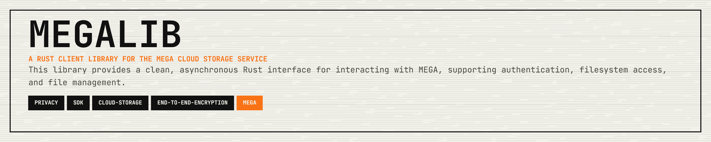

<p align="center">
  
</p>

<p align="center">
  <a href="https://crates.io/crates/megalib"></a>
  <a href="https://docs.rs/megalib"></a>
  <a href="https://opensource.org/licenses/MIT"></a>
  <a href="https://github.com/11philip22/megalib/pulls"></a>
</p>

<p align="center">
  <a href="#features">Features</a> · <a href="#installation">Installation</a> · <a href="#quickstart">Quickstart</a> · <a href="#running-the-cli-examples">Running the CLI Examples</a> · <a href="#documentation">Documentation</a> · <a href="#contributing">Contributing</a> · <a href="#support">Support</a> · <a href="#license">License</a>
</p>

---

## Features

- **Authentication**:
  - Full registration flow (account creation + email verification)
  - Login (supports both v1 and v2/PBKDF2 authentication)
  - Session management and caching
  - Password Change (`change_password`)

- **Filesystem**:
  - Fetch filesystem tree
  - List files and directories
  - Get node information (`stat`)
  - Create directories (`mkdir`)
  - Remove files/folders (`rm`)
  - Rename files/folders (`rename`)
  - Move files/folders (`mv`)
  - Access Public Folders (`open_folder`)

- **File Transfer**:
  - File upload with optional resume support
  - File download with resume support
  - Parallel transfer workers support
  - Progress callbacks for monitoring transfers
  - Text/Video/Image streaming support
  - Automatic thumbnail generation on upload
  - Public link generation (`export`, `export_many`)
  - Proxy support (HTTP/HTTPS/SOCKS5)

- **Node Operations**:
  - Preferred cached-tree browsing via `fetch_nodes`, `root_nodes`, `children_by_handle`, `child_node_by_name`, and `descendants`
  - Get node by handle
  - Check ancestor relationships
  - Check write permissions

- **Sharing & Contacts**:
  - Share folders with other users by path (`share_folder`)
  - List contacts (`list_contacts`)
  - Access incoming shared folders

## Installation

Add this to your `Cargo.toml`:

```toml
[dependencies]
megalib = "0.8.1"
tokio = { version = "1", features = ["full"] }
```

## Quickstart

Minimal login + cached-node browsing to confirm everything works:

```rust
use megalib::SessionHandle;

#[tokio::main]
async fn main() -> megalib::Result<()> {
    let session = SessionHandle::login("user@example.com", "password").await?;
    session.fetch_nodes().await?;

    let root = session
        .root_nodes()
        .await?
        .into_iter()
        .find(|node| node.node_type == megalib::NodeType::Root)
        .expect("missing Cloud Drive root");

    for node in session.children_by_handle(&root.handle).await? {
        println!("{} ({:?})", node.name, node.node_type);
    }

    if let Some(docs) = session.child_node_by_name(&root, "Documents").await? {
        println!("Documents handle: {}", docs.handle);
    }

    Ok(())
}
```

Path-based methods remain available as compatibility APIs over the cached node tree, but the old canonical names are now deprecated. Use the explicit aliases such as `list_by_path`, `stat_by_path`, `mkdir_by_path`, `mv_by_path`, `rename_by_path`, `rm_by_path`, `export_by_path`, and `upload_by_path` if you still want path-oriented calls. New code should prefer the node-first APIs shown above.

Node-first batch export is also available via `export_many_nodes`, which returns `(node, url)` pairs without converting back through remote paths.

## Examples

Run any command as shown (replace placeholder values with your own).

```bash
# Auth + listing
cargo run --example login -- --email you@example.com --password "your-password"
cargo run --example ls -- --email you@example.com --password "your-password" --path /Root
cargo run --example cached_session -- --email you@example.com --password "your-password"
cargo run --example node_api -- --email you@example.com --password "your-password"

# Upload / download
cargo run --example upload -- --email you@example.com --password "your-password" ./local-file.txt /Root
cargo run --example download -- --email you@example.com --password "your-password" /Root/remote-file.txt ./downloaded-file.txt

# Resume transfers
cargo run --example upload_resume -- --email you@example.com --password "your-password" ./large-file.bin /Root
cargo run --example download_resume -- --email you@example.com --password "your-password" /Root/large-file.bin ./large-file.bin

# Sharing + links
cargo run --example export -- --email you@example.com --password "your-password" --path /Root/file.txt
cargo run --example share -- --email you@example.com --password "your-password" --folder /Root/shared --recipient friend@example.com --level 0

# Filesystem operations
cargo run --example stat -- --email you@example.com --password "your-password" --path /Root/file.txt
cargo run --example mkdir -- --email you@example.com --password "your-password" /Root/new-folder
cargo run --example rm -- --email you@example.com --password "your-password" /Root/old-file.txt
cargo run --example rename -- --email you@example.com --password "your-password" /Root/file.txt file-renamed.txt
cargo run --example mv -- --email you@example.com --password "your-password" /Root/file.txt /Root/destination-folder

# Public links / folders
cargo run --example folder -- "https://mega.nz/folder/<FOLDER_ID>#<KEY>"
cargo run --example download_public -- "https://mega.nz/file/<FILE_ID>#<KEY>" ./public-file.bin

# In-memory / reader uploads
cargo run --example upload_bytes -- --email you@example.com --password "your-password" /Root
cargo run --example upload_reader -- --email you@example.com --password "your-password" /Root

# Account management
cargo run --example passwd -- --email you@example.com --password "current-password" --new "new-password"
cargo run --example register -- --email you@example.com --password "your-password" --name "Your Name"
cargo run --example verify -- --state "SESSION_KEY_FROM_STEP_1" --link "CONFIRMATION_LINK_OR_FRAGMENT"

# Full workflow demo
cargo run --example sequence -- --email you@example.com --password "your-password"
```
`--proxy <PROXY_URL>` is also supported on credential-based examples.

## Documentation

For detailed API documentation, visit [docs.rs/megalib](https://docs.rs/megalib).

## Contributing

Contributions are welcome! Please feel free to submit a Pull Request.

1. Fork the repository
2. Create your feature branch (`git checkout -b feature/cool-feature`)
3. Commit your changes (`git commit -m 'Add some cool feature'`)
4. Push to the branch (`git push origin feature/cool-feature`)
5. Open a Pull Request

## Support

If this crate saves you time or helps your work, support is appreciated:

[](https://ko-fi.com/11philip22)

## License

This project is licensed under the MIT License; see the [license](https://opensource.org/licenses/MIT) for details.

## Disclaimer

This is an unofficial client library and is not affiliated with, associated with, authorized by, endorsed by, or in any way officially connected with Mega Limited.
